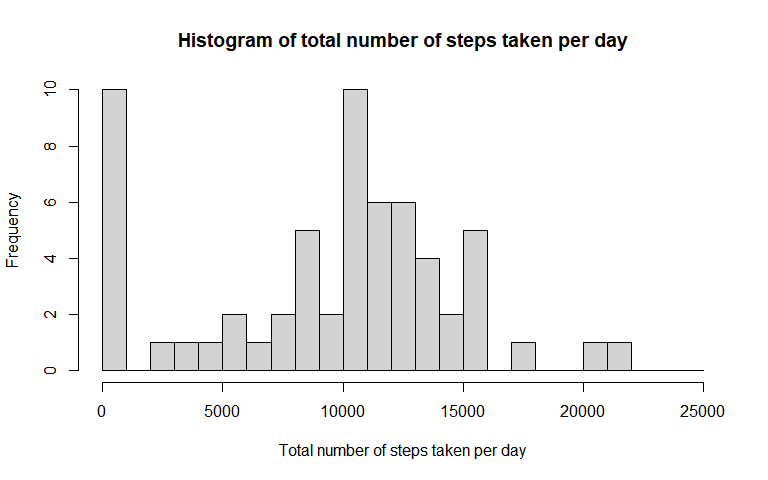
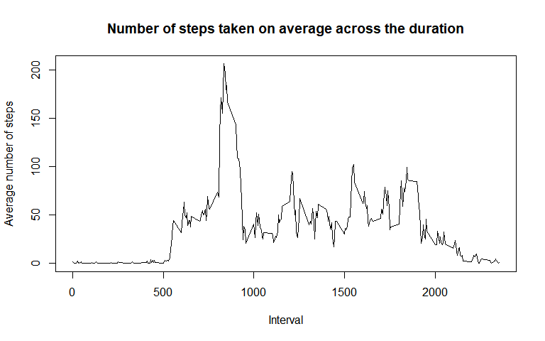
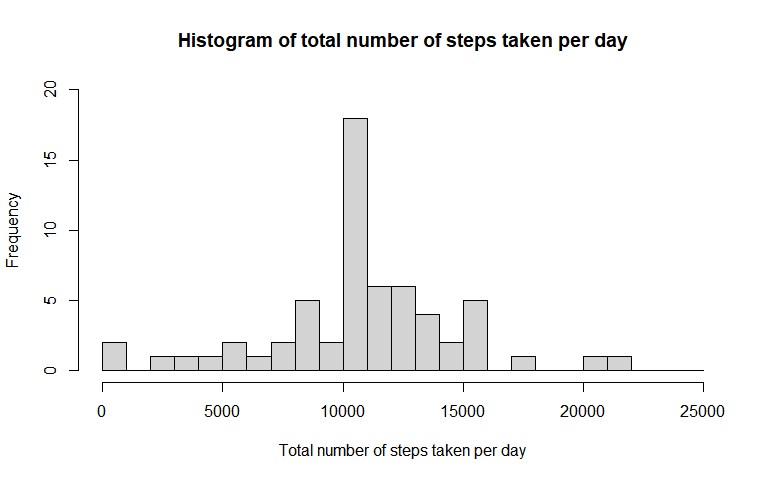
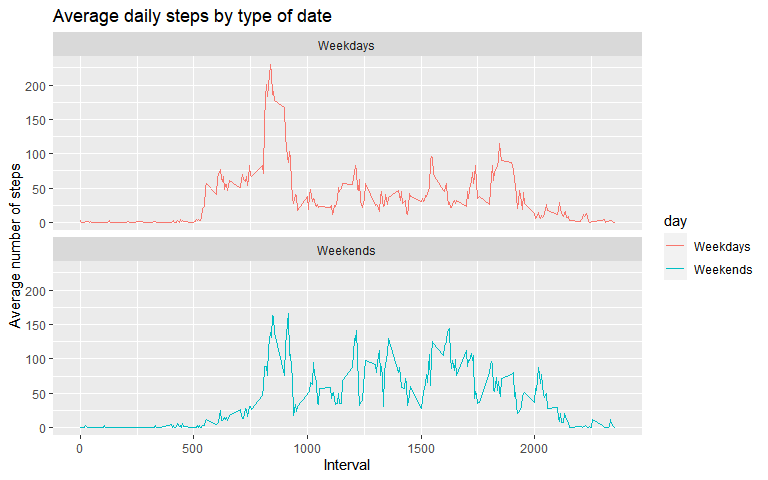

```r
knitr::opts_chunk$set(warning=FALSE, fig.height=5, fig.width=8, cache=TRUE)
library(dplyr)
```

```
## Warning: package 'dplyr' was built under R version 4.0.2
```

```
## 
## Attaching package: 'dplyr'
```

```
## The following objects are masked from 'package:stats':
## 
##     filter, lag
```

```
## The following objects are masked from 'package:base':
## 
##     intersect, setdiff, setequal, union
```

```r
library(ggplot2)
```

## Loading and preprocessing the data

```r
activity <- read.csv("activity.csv")
activity$date <- as.Date(activity$date, "%Y-%m-%d")
summary(activity)
```

```
##      steps             date               interval     
##  Min.   :  0.00   Min.   :2012-10-01   Min.   :   0.0  
##  1st Qu.:  0.00   1st Qu.:2012-10-16   1st Qu.: 588.8  
##  Median :  0.00   Median :2012-10-31   Median :1177.5  
##  Mean   : 37.38   Mean   :2012-10-31   Mean   :1177.5  
##  3rd Qu.: 12.00   3rd Qu.:2012-11-15   3rd Qu.:1766.2  
##  Max.   :806.00   Max.   :2012-11-30   Max.   :2355.0  
##  NA's   :2304
```


## What is mean total number of steps taken per day?
Below is a histogram showing the total number of steps taken per day:
  

```r
tot_steps <- with(activity, aggregate(x=steps, by=list(date), FUN=sum, na.rm=TRUE))
names(tot_steps) <- c("date", "steps")
hist(x=tot_steps$steps, breaks=seq(0, 25000, by=1000), main="Histogram of total number of steps taken per day", xlab="Total number of steps taken per day")
```

<!-- -->
  
The **mean** of the total number of steps taken per day is 

```r
mean(tot_steps$steps)
```

```
## [1] 9354.23
```
while the **median** is 

```r
median(tot_steps$steps)
```

```
## [1] 10395
```


## What is the average daily activity pattern?
Below is a time series plot of the 5-minute interval and the average number of steps taken, averaged across all days:


```r
avg_act <- with(activity, aggregate(x=steps, by=list(interval), FUN=mean, na.rm=TRUE))
names(avg_act) <- c("interval", "mean_step_num")
plot(x=avg_act$interval, y=avg_act$mean_step_num, type="l", main="Number of steps taken on average across the duration", xlab="Interval", ylab="Average number of steps", lwd = 1.5)
```

<!-- -->

The 5-minute interval that contains the maximum number of steps on average is

```r
avg_act[which.max(avg_act$mean_step_num), ]$interval
```

```
## [1] 835
```


## Imputing missing values
The total number of missing values in the dataset is

```r
sum(is.na(activity$steps))
```

```
## [1] 2304
```

The missing values are filled in with the mean number of steps of the interval they belong to:

```r
filled_na <- avg_act$mean_step_num[match(activity$interval, avg_act$interval)]
```

Add in the imputed values to create a new dataset:

```r
new_activity <- transform(activity, steps=ifelse(is.na(activity$steps), yes=filled_na, no=activity$steps))
new_tot_steps <- aggregate(new_activity$steps~new_activity$date, FUN=sum)
names(new_tot_steps) <- c("date", "steps")
```

The histogram of total number of steps taken per day is updated to be compared with the previous graph:

```r
hist(new_tot_steps$steps, breaks=seq(0, 25000, by=1000), main="Histogram of total number of steps taken per day", xlab="Total number of steps taken per day", ylim=c(0, 20))
```

<!-- -->

The new **mean** of the total number of steps taken per day is

```r
mean(new_tot_steps$steps)
```

```
## [1] 10766.19
```
while the new **median** is 

```r
median(new_tot_steps$steps)
```

```
## [1] 10766.19
```

The values are different from what were seen previously. The imputation of missing data has increased the estimates of the total daily number of steps.


## Are there differences in activity patterns between weekdays and weekends?
A new factor variable 'day' is created to indicate if a given day is a weekday or weekend:

```r
new_activity <- mutate(new_activity, day=weekdays(new_activity$date))
weekdays_list <- c('Monday', 'Tuesday', 'Wednesday', 'Thursday', 'Friday')
new_activity$day <- factor((weekdays(new_activity$date) %in% weekdays_list), 
         levels=c(TRUE, FALSE), labels=c('Weekdays', 'Weekends'))
```

To show the differences in activity patterns between weekdays and weekends, a panel of time series plots of the time interval and average number of steps taken, averaged across all weekdays or weekends, is created as below:

```r
act_days <- aggregate(steps~interval + day, data=new_activity, FUN=mean)
ggplot(data=act_days, aes(x=interval, y=steps, color=day)) + 
  geom_line() + 
  labs(title="Average daily steps by type of date", x="Interval", y="Average number of steps") + 
  facet_wrap(facets=~day, nrow=2, ncol=1)
```

<!-- -->
